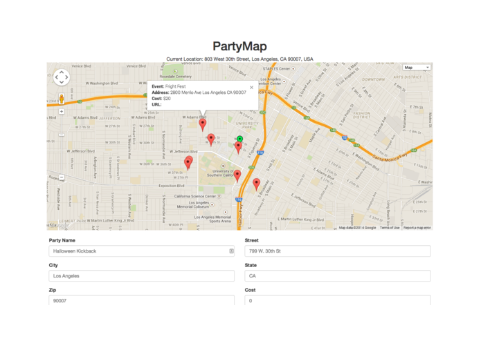

PartyMap, Trojan Hacks ’14 (28 hours)
======================================
* Map for user-entered events around your current location.
* Built with Javascript, Bootstrap, Google Maps API, Geolocation API and Firebase.

Halloween is coming soon and you know there'll be a lot of parties (and candy), but when a party is shut down too early and you're not ready to call it a night, use PartyMap to find what parties are still happening around you.

You don't have to scroll through Facebook invites or text friends to look for a party. Quickly find one nearby and bring your friends along!